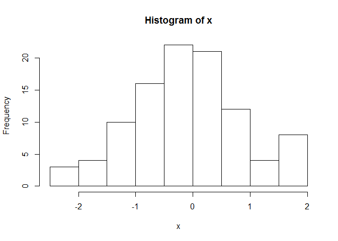
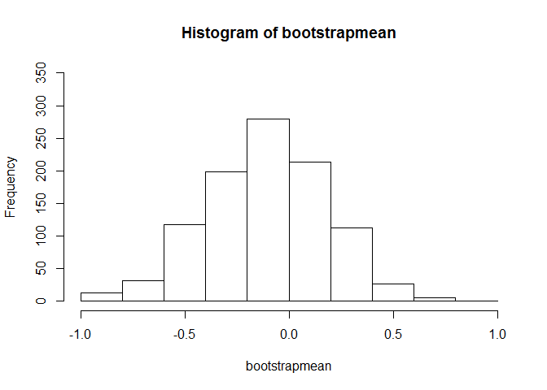
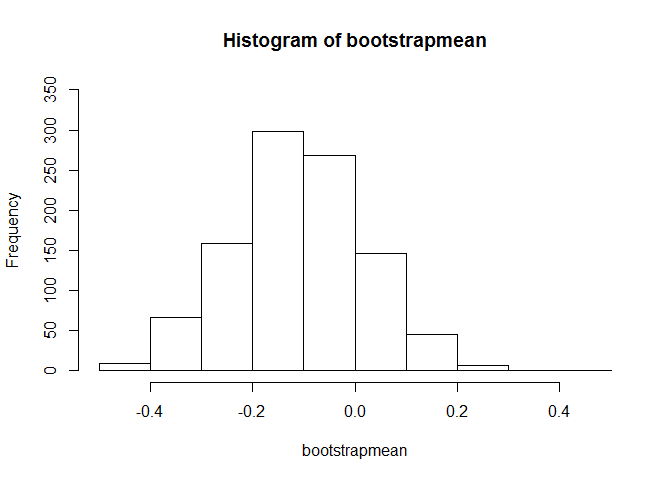
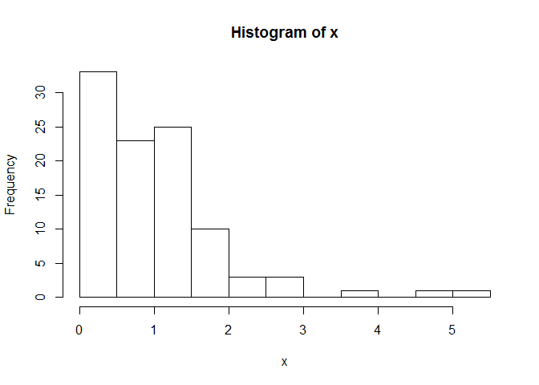
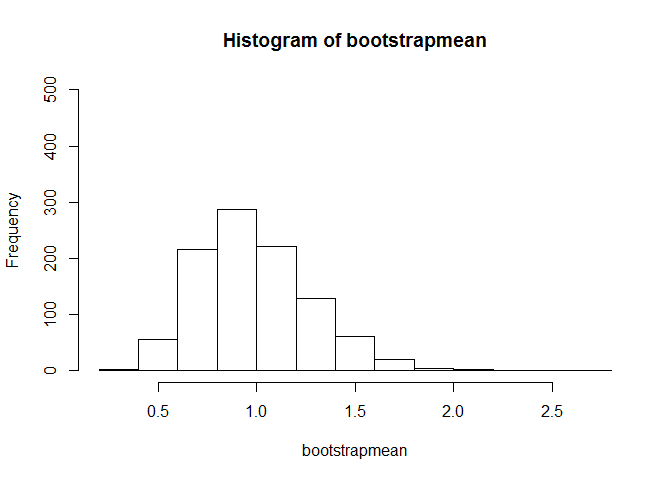
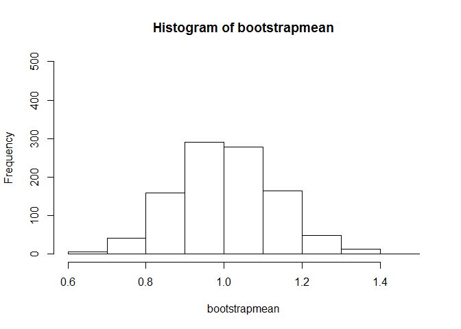

# homework4
Joseph Cook  
October 26, 2016  


#Normally distribution

```r
#First we need to setup the loops and create the normal distribution
r <- 1000
x <- rnorm(100)
bootstrapmean <- numeric(r)
hist(x)
```

<!-- -->

```r
#As we can see are sample already follows a normal distribution and through the bootstrap we will return another example of normal distribution.  The power of the central limit theorem will be shown in the exponential distribution 

#Bootstrap using sample of 10 a 1000 times.
for (i in 1:r){
  y <- sample(x,size= 10, replace = TRUE)
  bootstrapmean[i] <- mean(y)
}

summary(bootstrapmean)
```

```
##    Min. 1st Qu.  Median    Mean 3rd Qu.    Max. 
## -0.9971 -0.2988 -0.1061 -0.1102  0.0780  0.9065
```

```r
hist(bootstrapmean, ylim=c(0,350))
```

<!-- -->

```r
#Bootstrap using sample of 50 a 1000 times.
for (i in 1:r){
  y <- sample(x,size= 50 , replace = TRUE)
  bootstrapmean[i] <- mean(y)
}

summary(bootstrapmean)
```

```
##    Min. 1st Qu.  Median    Mean 3rd Qu.    Max. 
## -0.4781 -0.1950 -0.1098 -0.1080 -0.0184  0.4553
```

```r
hist(bootstrapmean, ylim=c(0,350))
```

<!-- -->


```r
#First we need to setup the loops and create the expontial distribution
r <- 1000
x <- rexp(100)
bootstrapmean <- numeric(r)
hist(x)
```

<!-- -->

```r
#as we can see from the chart above this does not have anything close to a normal distibution.  However after taking samples we will generate a normal distibution of the means.  Thus providing evidence for the central limit theorem that the means are normally distributed

#Bootstrap using sample of 10 a 1000 times.
for (i in 1:r){
  y <- sample(x, size=10 , replace = TRUE)
  bootstrapmean[i] <- mean(y)
}

summary(bootstrapmean)
```

```
##    Min. 1st Qu.  Median    Mean 3rd Qu.    Max. 
##  0.3502  0.7839  0.9589  0.9936  1.1620  2.6050
```

```r
hist(bootstrapmean, ylim=c(0,500))
```

<!-- -->

```r
#Bootstrap using sample of 50 a 1000 times.
for (i in 1:r){
  y <- sample(x,size=50, replace = TRUE)
  bootstrapmean[i] <- mean(y)
}

summary(bootstrapmean)
```

```
##    Min. 1st Qu.  Median    Mean 3rd Qu.    Max. 
##  0.6419  0.9184  1.0020  1.0050  1.0900  1.4130
```

```r
hist(bootstrapmean, ylim=c(0,500))
```

<!-- -->
